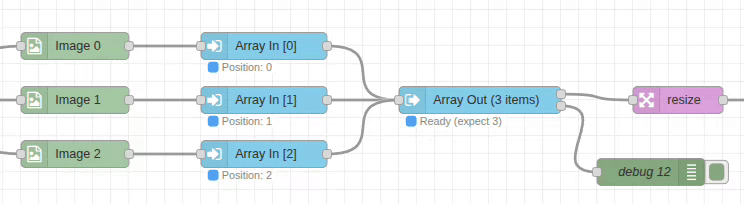

# Array-Out Node

## Purpose & Use Cases

The `array-out` node serves as the collection point for multiple `array-in` nodes, assembling ordered arrays from parallel data streams. It provides timeout protection and ensures data integrity during the assembly process.

**Real-World Applications:**
- **Batch Image Processing**: Assemble multiple images for simultaneous operations
- **Multi-Camera Synchronization**: Collect frames from multiple cameras in sequence
- **Parallel Pipeline Merging**: Combine results from parallel processing workflows  
- **Data Aggregation**: Merge processed data from multiple sources
- **Quality Control**: Collect inspection results from multiple checkpoints



## Input/Output Specification

### Inputs
Messages from `array-in` nodes containing:
```javascript
{
  ...originalMessage,
  payload: any,           // Fallback data source
  meta: {
    arrayPosition: number,  // Position index (0, 1, 2, ...)
    arrayData: any         // Preferred data source (takes priority over payload)
  }
}
```

**Data Extraction Priority**: The node prefers `msg.meta.arrayData` but falls back to `msg.payload` if arrayData is undefined.

### Outputs

#### Output 1 - Complete Array (Success)
```javascript
[data0, data1, data2, ...]  // Ordered array of collected data
```

#### Output 2 - Timeout Data (Error)
```javascript
{
  [outputPath]: [data0, null, data2, ...],  // Partial array in configured location
  meta: {
    timeout: true,                     // Timeout flag
    missingPositions: [1, 4],         // Positions that didn't arrive  
    collectedPositions: [0, 2, 3],    // Positions that were collected
    expectedCount: 5,                 // Number expected
    collectedCount: 3,                // Number actually collected
    elapsed: 5000                     // Time elapsed in milliseconds
  }
}
```

## Configuration Options

### Expected Count
- **Type**: Number (required)
- **Range**: Minimum 1
- **Purpose**: Number of array elements required before output
- **Validation**: Must match the number of connected array-in nodes
- **Impact**: Array assembly completes when this many elements are collected

### Timeout
- **Type**: Number (milliseconds)
- **Default**: 5000ms (5 seconds)
- **Range**: Minimum 100ms
- **Purpose**: Maximum wait time for all elements after first message
- **Behavior**: Sends partial data to output 2 on timeout

### Output Location
- **Default**: `msg.payload`
- **Options**:
  - `msg.*` - Store in message property
  - `flow.*` - Store in flow context
  - `global.*` - Store in global context
- **Purpose**: Where to store the assembled array

## Performance Notes

### Assembly Strategy
- **Efficient Collection**: Uses position-based indexing for O(1) insertion
- **Memory Management**: Minimal overhead during collection
- **Timeout Protection**: Prevents indefinite waiting for missing data
- **State Reset**: Automatic cleanup between collection cycles

### Status Display
- **Collection Progress**: Shows number of items collected vs expected
- **Success Timing**: Displays total assembly time on completion
- **Timeout Warning**: Indicates when timeout occurs with diagnostic info

## Real-World Examples

### Basic Image Array Assembly
```
[Image-In: img1.jpg] → [Array-In: pos=0] ┐
[Image-In: img2.jpg] → [Array-In: pos=1] ├→ [Array-Out: count=3, timeout=500] → [Resize: All Images]
[Image-In: img3.jpg] → [Array-In: pos=2] ┘
```
Collect three images for batch resizing.

### Multi-Camera Frame Collection
```
[Camera 1] → [Array-In: pos=0] ┐
[Camera 2] → [Array-In: pos=1] ├→ [Array-Out: count=4, timeout=100] → [Sync Analysis]
[Camera 3] → [Array-In: pos=2] │
[Camera 4] → [Array-In: pos=3] ┘
```
Synchronize frames from multiple cameras with tight timing.

### Parallel Processing Merge
```
→ [Process A] → [Array-In: pos=0] ┐
→ [Process B] → [Array-In: pos=1] ├→ [Array-Out: count=3, timeout=500] → [Combine Results]
→ [Process C] → [Array-In: pos=2] ┘
```
Merge results from parallel processing pipelines.

### Quality Control Assembly
```
[Inspection A] → [Array-In: pos=0] ┐
[Inspection B] → [Array-In: pos=1] ├→ [Array-Out: timeout=10000] → [Final Report]
[Inspection C] → [Array-In: pos=2] ┘
```
Collect quality control results with extended timeout.

## Common Issues & Troubleshooting

### Timeout Issues
- **Issue**: Frequent timeouts preventing array completion
- **Causes**: Slow upstream processing, network delays, missing data
- **Solutions**: 
  - Increase timeout value for slow processes
  - Add debug nodes to identify bottlenecks
  - Implement fallback logic using output 2

### Count Mismatch
- **Issue**: Expected count doesn't match number of array-in nodes
- **Result**: Perpetual waiting or premature completion
- **Solution**: Verify expected count equals number of connected array-in nodes

### Position Conflicts
- **Issue**: Multiple array-in nodes using same position
- **Result**: Data overwrites, array count confusion
- **Solution**: Ensure each array-in node has unique position

### Missing Metadata
- **Issue**: Messages arriving without proper meta.arrayPosition
- **Result**: Messages ignored, incomplete arrays
- **Solution**: Verify all input messages come from array-in nodes
