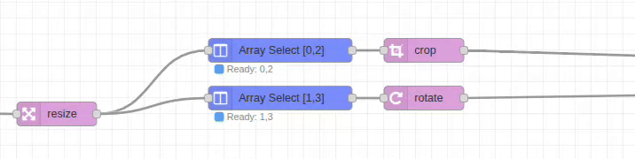

# Array-Select Node

## Purpose & Use Cases

The `array-select` node provides powerful array element selection with Python-like slicing syntax. It extracts specific elements, ranges, or patterns from arrays, making it essential for filtering and selecting processed results.

**Real-World Applications:**
- **Result Filtering**: Select best results from batch processing operations
- **Data Sampling**: Extract samples from large datasets for analysis
- **Quality Control**: Pick specific items that passed validation
- **A/B Testing**: Select specific variants for comparison
- **Image Gallery Creation**: Choose specific images from collections



## Input/Output Specification

### Inputs
- **Array Data**: Input array from the configured path
- **Selection String**: Pattern specifying which elements to extract

### Outputs
- **Single Element**: Direct element output (unless Force Array enabled)
- **Multiple Elements**: Always output as array
- **Invalid Selection**: No message sent, warning logged

## Configuration Options

### Input From
- **Default**: `msg.payload`
- **Options**:
  - `msg.*` - Read from message property
  - `flow.*` - Read from flow context
  - `global.*` - Read from global context
- **Validation**: Input must be an array

### Selection Pattern
- **Type**: String with flexible syntax
- **Formats**:
  - **Single Index**: `0`, `2`, `-1`
  - **Multiple Indices**: `1,3,5` (comma-separated)
  - **Range**: `1:4` (slice from index 1 to 3)
  - **Step Pattern**: `0::2` (every 2nd element)
  - **Negative Indexing**: `-1` (last), `-2:` (last two)

### Force Array
- **Type**: Boolean checkbox
- **Default**: false
- **Behavior**: When enabled, single elements output as arrays
- **Use Case**: Ensure consistent array output format

## Performance Notes

### Selection Efficiency
- **Minimal Memory Copy**: Efficient element extraction without full array duplication
- **Index Validation**: Fast bounds checking with graceful error handling
- **Pattern Parsing**: Optimized pattern recognition and processing
- **Status Display**: Real-time selection information and processing state

### Error Handling
- **Input Validation**: Comprehensive array and pattern validation
- **Graceful Degradation**: Invalid indices skipped with warnings
- **Bounds Checking**: Out-of-range indices handled safely

## Selection Syntax Guide

### Basic Selection
```
Array: ["A", "B", "C", "D", "E"]

0      → "A"         // First element
-1     → "E"         // Last element
1,3    → ["B", "D"]  // Multiple specific indices
```

### Range Selection
```
Array: ["A", "B", "C", "D", "E"]

1:4    → ["B", "C", "D"]  // Range from 1 to 3
0:3    → ["A", "B", "C"]  // First three elements
-2:    → ["D", "E"]       // Last two elements
```

### Step Patterns
```
Array: ["A", "B", "C", "D", "E", "F"]

0::2   → ["A", "C", "E"]     // Every 2nd starting at 0
1::2   → ["B", "D", "F"]     // Every 2nd starting at 1
1:5:2  → ["B", "D"]          // Range 1-4, every 2nd
```

### Advanced Patterns
```
Array: [0, 1, 2, 3, 4, 5, 6, 7, 8, 9]

::3     → [0, 3, 6, 9]       // Every 3rd element
2:8:2   → [2, 4, 6]          // Range 2-7, step 2
-3:     → [7, 8, 9]          // Last 3 elements
:-3     → [0, 1, 2, 3, 4, 5, 6]  // All but last 3
```

## Real-World Examples

### Best Result Selection
```
[Batch Process] → [Array-Out] → [Array-Select: "0,2,4"] → [Top Results]
```
Select 1st, 3rd, and 5th results from batch processing.

### Quality Control Sampling
```
[Production Line] → [Array-Out] → [Array-Select: "::10"] → [Quality Check]
```
Sample every 10th item for quality inspection.

### Image Gallery Creation
```
[Image Array] → [Array-Select: "1:6"] → [Display Gallery]
```
Select images 2-6 for gallery display.

### A/B Test Splitting
```
[User Array] → [Array-Select: "0::2"] → [Group A]
            → [Array-Select: "1::2"] → [Group B]
```
Split users into alternating test groups.

### Last N Results
```
[Processing Queue] → [Array-Out] → [Array-Select: "-5:"] → [Recent Results]
```
Get the last 5 processed items.

## Common Issues & Troubleshooting

### Invalid Input Type
- **Issue**: Input is not an array
- **Result**: Warning logged, message not sent
- **Solution**: Verify input is array type, use array-out to create arrays

### Out of Bounds Indices
- **Issue**: Selection indices exceed array length
- **Result**: Invalid indices ignored, partial results returned
- **Example**: Array length 5, selection "1,3,7" returns elements at indices 1,3 only

### Empty Selection Results
- **Issue**: Selection pattern matches no elements
- **Result**: Empty array `[]` output
- **Common Cause**: Range beyond array bounds

### Syntax Errors
- **Issue**: Invalid selection pattern syntax
- **Result**: Warning logged, message not sent
- **Solution**: Verify pattern follows documented syntax